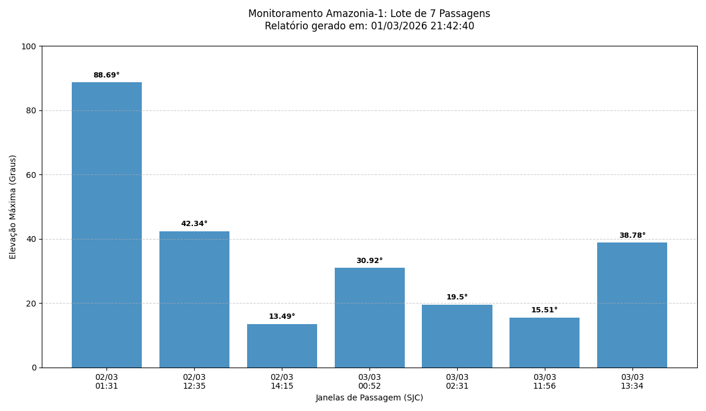
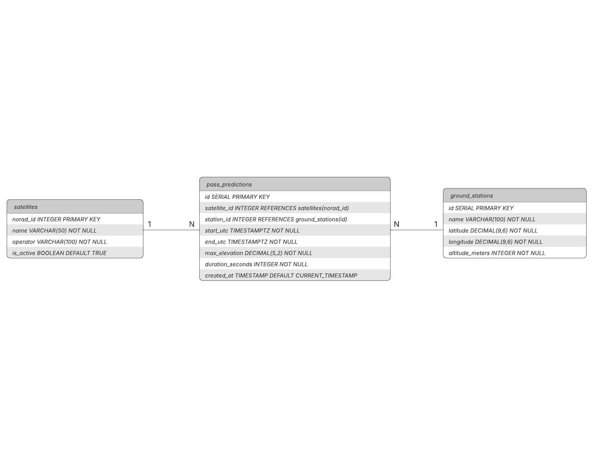

# 🛰️ Monitoramento Orbital Amazonia-1

Este sistema é um pipeline de dados (ETL) desenvolvido para prever e visualizar as janelas de passagem do satélite Amazonia-1 sobre a estação de solo em São José dos Campos (SJC). O projeto integra a extração de dados via API, processamento em Python, persistência em banco de dados relacional e geração automática de relatórios gráficos.

## 📋 Matriz de Requisitos

| ID | Requisito | Tipo | Prioridade | Status |
|----|-----------|------|------------|--------|
| RF-01 | Extrair dados de passagens via API N2YO | Funcional | Alta | ✅ Implementado |
| RF-02 | Armazenar dados no PostgreSQL | Funcional | Alta | ✅ Implementado |
| RF-03 | Transformar timestamps Unix para ISO UTC | Funcional | Alta | ✅ Implementado |
| RF-04 | Calcular duração das passagens em segundos | Funcional | Média | ✅ Implementado |
| RF-05 | Gerar gráficos de elevação máxima | Funcional | Média | ✅ Implementado |
| RNF-01 | Arquitetura modular e escalável | Não Funcional | Alta | ✅ Implementado |
| RNF-02 | Gestão de variáveis de ambiente via `.env` | Não Funcional | Alta | ✅ Implementado |

---

## 📊 Resultados de Monitoramento

O sistema exporta automaticamente relatórios gráficos para análise da qualidade das janelas de comunicação. O gráfico abaixo apresenta a elevação máxima atingida pelo satélite em cada passagem prevista sobre a estação de solo:



> **Nota:** As barras representam a elevação máxima (em graus). Passagens com elevação superior a 30° são consideradas ideais para recepção de sinal estável.

---

## 🛠️ Tecnologias Utilizadas

| Categoria | Tecnologia |
|-----------|------------|
| Linguagem | Python 3.11 |
| Banco de Dados | PostgreSQL 17 |
| Extração de dados | `requests` |
| ORM / Conexão DB | `sqlalchemy` |
| Manipulação de dados | `pandas` |
| Visualização | `matplotlib` |
| Variáveis de ambiente | `python-dotenv` |

---

## 📐 Arquitetura do Pipeline (ETL)

O projeto está organizado modularmente para garantir escalabilidade:

1. **Extração** (`extractor.py`): Realiza requisições à API N2YO para buscar as próximas passagens de rádio.
2. **Transformação** (`transformer.py`): Converte timestamps Unix para ISO UTC e calcula a duração de cada passagem em segundos.
3. **Carga** (`database.py`): Insere os dados processados no PostgreSQL utilizando o Engine do SQLAlchemy.
4. **Visualização** (`visualizer.py`): Gera relatórios gráficos na pasta `docs/assets/reports/` com carimbos de data/hora.
5. **Orquestração** (`main.py`): Script principal que coordena o fluxo completo do pipeline.

---

## 📊 Modelagem de Dados

A estrutura relacional foi desenhada para manter a integridade dos dados orbitais:

| Tabela | Descrição |
|--------|-----------|
| `satellites` | Cadastro de satélites identificados por NORAD ID |
| `ground_stations` | Coordenadas geográficas das estações de solo |
| `pass_predictions` | Registro histórico de janelas de passagem, com chaves estrangeiras para satélites e estações |



## 📈 Resultados

O sistema gera automaticamente gráficos de elevação máxima por janela de passagem, salvos em:

```
docs/assets/reports/
```

Os arquivos são nomeados com carimbo de data/hora para rastreabilidade histórica.

---

## 🚀 Como Executar

### 1. Instale as dependências

```bash
pip install -r requirements.txt
```

### 2. Configure o Banco de Dados

Execute os arquivos SQL na seguinte ordem:

```bash
01_create_table.sql
02_insert_data.sql
```

### 3. Variáveis de Ambiente

Crie um arquivo `.env` na raiz do projeto com as seguintes credenciais:

```env
DB_HOST=localhost
DB_PORT=5432
DB_NAME=nome_do_banco
DB_USER=seu_usuario
DB_PASSWORD=sua_senha
N2YO_API_KEY=sua_api_key
```

### 4. Execute o Pipeline

```bash
python main.py
```

